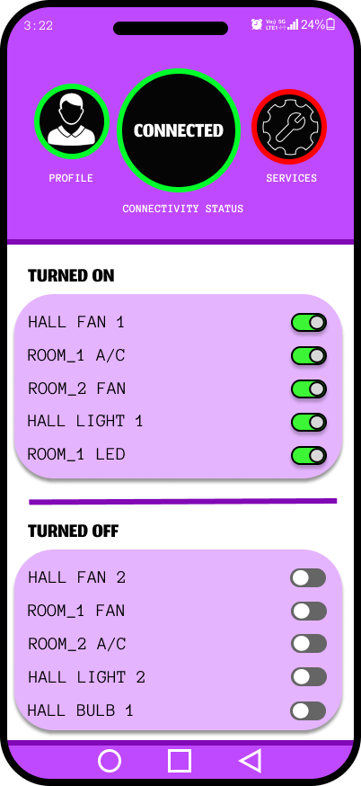
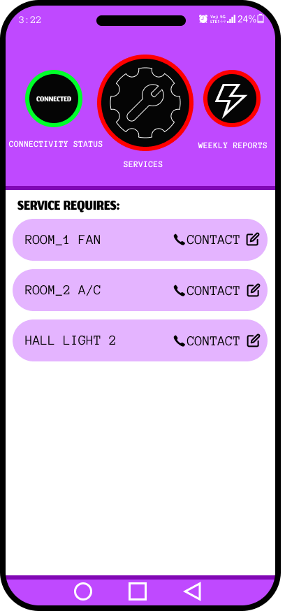
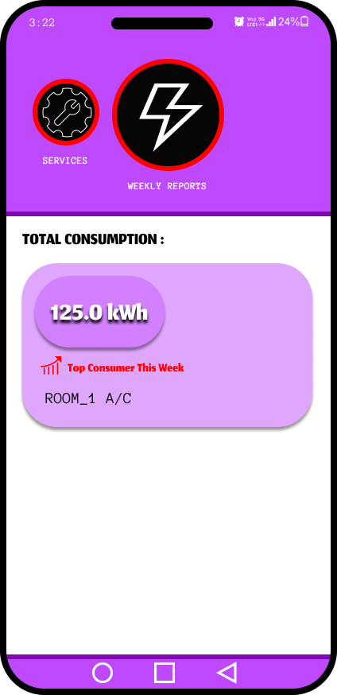

# Smart Home App Design – UI/UX

📌 **Project Overview**  
This project represents a UI/UX design for a Smart Home App created using Figma. The design focuses on controlling smart devices in a home, such as lights, fans, and AC units, with user-friendly controls and real-time monitoring of energy consumption.

🎯 **Objective**  
- Provide users with an intuitive way to control and monitor smart devices in their homes.
- Offer features like device on/off controls, consumption tracking, and service requests.
- Use familiar design patterns for easy navigation and clear functionality.

👥 **Target Users**  
- Homeowners using smart devices.
- Users interested in monitoring energy consumption.
- People who want to control their smart devices remotely.

🧠 **Design Process**  
- Analyzed existing smart home apps and identified key user actions (control devices, monitor usage, request services).
- Focused on usability, clear labeling, and ease of navigation.
- Designed a responsive UI using Figma to create a visually engaging and functional interface.

🧩 **Page Structure & UI Sections**

1️⃣ **Device Control Page**  
   - Allows users to view and control smart devices like fans, lights, and AC units.
   - Features a list of devices, their status (on/off), and the ability to turn them on or off.

2️⃣ **Connectivity & Device Status Page**  
   - Displays the current connectivity status of the smart home system.
   - Shows which devices are turned on and their operational status.

3️⃣ **Service Requests Page**  
   - Users can view and request services for devices that require maintenance or troubleshooting.
   - Includes contact options for each device that needs attention.

4️⃣ **Consumption & Weekly Report Page**  
   - Displays total energy consumption and highlights the top consumer devices for the week.
   - Provides real-time statistics for efficient energy use monitoring.

🎨 **UI/UX Principles Applied**
- **Visual Hierarchy**: Clear and easy-to-understand layout.
- **Consistency**: Consistent design elements for easy navigation.
- **Familiar Design Patterns**: Used patterns familiar in smart home apps to ensure usability.
- **Accessibility**: Ensured readability and clear button actions for users.

🛠 **Tools Used**  
- Figma (for design)

🔗 **Figma Design Link**  
[View Figma Design](https://www.figma.com/design/qO8tmBzeBzmUhvZLkZJA3t/smart-home?node-id=0-1&t=wZz2AzB8dIvWw2RK-1)

📸 **Screenshots**
Here are the design screens for the Smart Home App:

1. **Device Control Page**  
   

2. **Connectivity & Device Status Page**  
   

3. **Service Requests Page**  
   

4. **Consumption & Weekly Report Page**  
   

